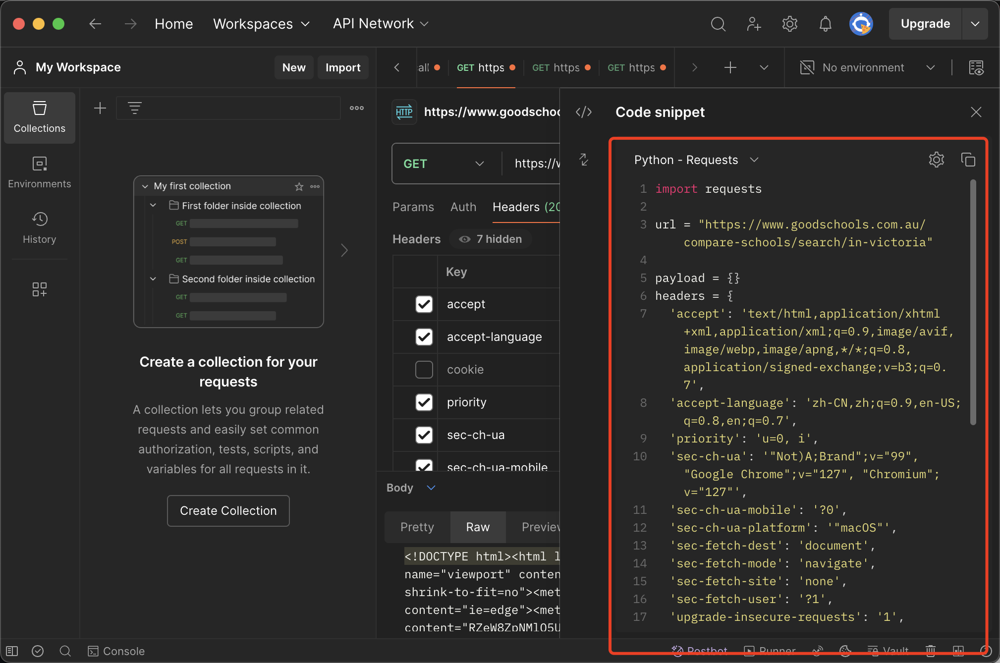
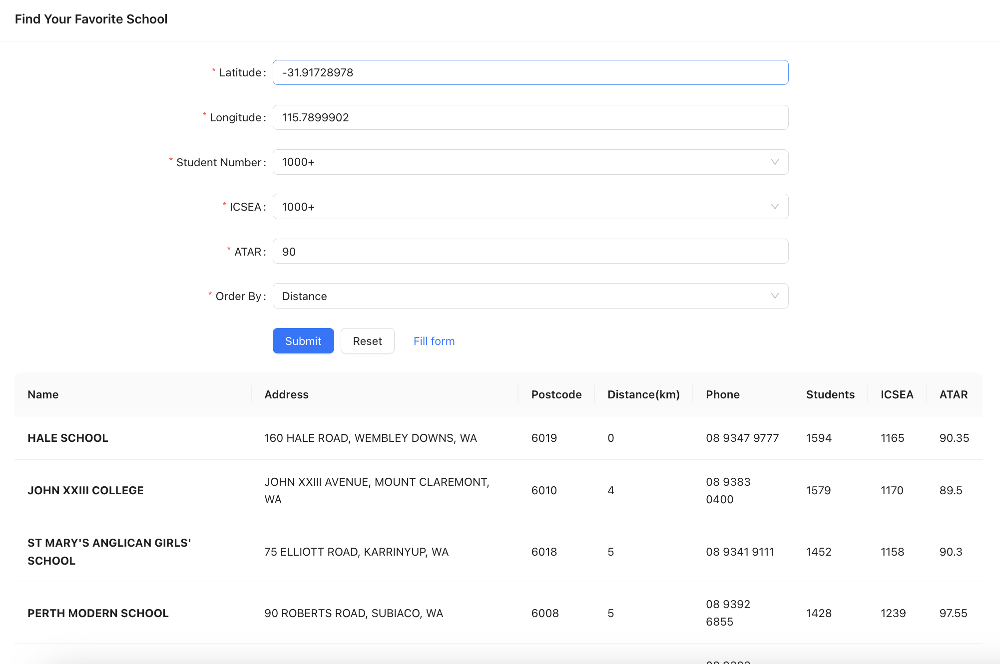

## Task 1

### 1. Tools

Chrome Developer Tools, Postman, Python (BeautifulSoup, geopy), Google Maps Platform

### 2. Crawling Search Pages

#### 1. Generate Python Request Code Using Postman

First, open Chrome Developer Tools. It's clear that the webpage is server-side rendered, so we need to crawl the HTML document to analyze and obtain the required data.

We use Chrome Developer Tools to export the link request as a cURL request code. Here's an example of a cURL request:

```bash
curl 'https://www.goodschools.com.au/compare-schools/search/in-victoria?distance=10km&suburb_in=in-victoria&state_ids%5B0%5D=7&region_ids%5B0%5D=1300&page=1' \
  -H 'accept: text/html,application/xhtml+xml,application/xml;q=0.9,image/avif,image/webp,image/apng,*/*;q=0.8,application/signed-exchange;v=b3;q=0.7' \
  -H 'accept-language: zh-CN,zh;q=0.9,en-US;q=0.8,en;q=0.7' \
  ......
  -H 'user-agent: Mozilla/5.0 (Macintosh; Intel Mac OS X 10_15_7) AppleWebKit/537.36 (KHTML, like Gecko) Chrome/127.0.0.0 Safari/537.36'
```

Then, import this request into Postman using cURL and generate Python code with the Code snippet feature:



Encapsulate this code into a function `get_search_page()` and make adjustments to pass the page number as a parameter, allowing you to crawl different pages. The HTTP crawling code is complete.

#### 2. Analyze Webpage Layout Using Chrome Developer Tools

Back in Chrome, open Developer Tools and go to the Elements tab. By inspecting the HTML code blocks (which are highlighted when selected), we can visually identify where the required data is located.


The green circle in the image represents the HTML code for a school. Since we need information like Academic Results, it's best to go to the details page to extract data. Therefore, the red section is what we need.

In the Python code, use the `BeautifulSoup` library to parse the HTML and locate the `div` containing the link by searching for `class="col-12 text-center d-block d-sm-none"` (which is unique on the page). This allows us to extract the URL of the details page.

#### 3. Crawling Example

Encapsulate the above HTTP parsing code into `extract_school_urls`, which works with `get_search_page()` to read all school detail page URLs from the current page. For page 1, the crawled data looks like this:

```bash
['https://www.goodschools.com.au/compare-schools/in-mont-albert-north-3129/box-hill-senior-secondary-college', 'https://www.goodschools.com.au/compare-schools/in-brighton-3186/brighton-grammar-school', 'https://www.goodschools.com.au/compare-schools/in-burwood-east-3151/burwood-heights-primary-school', 'https://www.goodschools.com.au/compare-schools/in-kew-3101/carey-baptist-grammar-school', 'https://www.goodschools.com.au/compare-schools/in-sydenham-3037/catholic-regional-college-sydenham', 'https://www.goodschools.com.au/compare-schools/in-south-yarra-3141/centre-for-higher-education-studies', 'https://www.goodschools.com.au/compare-schools/in-kew-3101/genazzano-fcj-college', 'https://www.goodschools.com.au/compare-schools/in-narre-warren-south-3805/heritage-college', 'https://www.goodschools.com.au/compare-schools/in-mitcham-3132/mullauna-college', 'https://www.goodschools.com.au/compare-schools/in-toorak-3142/st-catherines-school-toorak']
```

### 3. Crawling School Detail Pages

The logic for crawling school detail pages is similar to that in section 1. The `get_detail_page()` function is used to crawl HTML, and `parse_school_details()` is used to parse the HTML.

The required data is parsed into a `dict`. For example, the parsed result for the page `https://www.goodschools.com.au/compare-schools/in-mont-albert-north-3129/box-hill-senior-secondary-college` is:

```bash
{
   "School Name":"Box Hill Senior Secondary College",
   "Sector":"Government",
   "Level":"Combined",
   "Gender":"Co-Ed",
   "Religion":"Secular",
   "Principal":"Mr Warren Dawson",
   "Address":"19 Dunloe Ave Mont Albert North Victoria 3129",
   "Tel":"(03) 9890 0571",
   "Scores of 40+":"1%",
   "Median Score":"26",
   "Satisfactory completions of VCE":"95%",
   "Satisfactory completions of VET":"59%"
}
```

### 4. Data Processing

1. Extract Postcodes from Address Information Using Regular Expressions

According to the task requirements, we need to obtain each school's postcode. However, postcodes are not presented as separate elements on the page and cannot be directly crawled.

Upon inspection, it is observed that the last four digits of each school's address are the postcode. Therefore, we use regular expressions to extract the last four digits of the address as the postcode.

2. Obtain Latitude and Longitude Using Geopy

Additionally, we need not only the school's address but also its physical location, i.e., latitude and longitude. Latitude and longitude are not directly available on the page, but Google provides an API to convert addresses to geographic coordinates.

We registered for a Google Developer account and applied for the API:


The API can be accessed using Python's `geopy` library. The method `geolocator.geocode()` provides a set of location information, including latitude and longitude, which we save.

Thus, we complete the data processing part, encapsulating the entire process into the `process()` function. After processing the data, it looks like this:

```bash
{
   "School Name":"Box Hill Senior Secondary College",
   "Sector":"Government",
   "Level":"Combined",
   "Gender":"Co-Ed",
   "Religion":"Secular",
   "Principal":"Mr Warren Dawson",
   "Address":"19 Dunloe Ave Mont Albert North Victoria 3129",
   "Tel":"(03) 9890 0571",
   "Scores of 40+":"1%",
   "Median Score":"26",
   "Satisfactory completions of VCE":"95%",
   "Satisfactory completions of VET":"59%",
   "Latitude":-37.8094011,
   "Longitude":145.1130093,
   "Postcode":"3129"
}
```

### 5. Export CSV

Finally, export the data in CSV format. For empty data fields, use `N/A`.

In `./school_info.csv`, I have crawled data for 96 schools in Victoria across 10 pages, including information like name, postcode, geolocation, sector, and academic results.

### 6. Difficulties and Challenges

1. Ensuring that the location data is unique and accurately recognized by Google Maps services is a major challenge.

   In my code, I added the AU identifier to the end of the address to indicate that it is in Australia and saved the original address data to quickly identify errors.

   Despite this, the method is somewhat unreliable.

2. There are many schools on GoodSchools that do not provide Academic Results or other information. These fields are currently filled with `N/A`. This data significantly contaminates the results. Therefore, careful data cleaning is essential if the data is to be used for training.

## Task 2

### 1. Overall Approach

1. **Clustering Schools:** Divide schools into different clusters.

2. **Generating Hypothetical Location:** Based on student input, including home address, expected grades, and other parameters, create a hypothetical location within the cluster. Then, find nearby schools based on this location.

3. **Recommendation:** Recommend the closest schools to students, allowing them to sort the results based on various parameters.

### 2. K-means Algorithm

K-means is a classic clustering algorithm that has been well-tested in industry and meets our requirements for clustering schools.

#### 1. Parameter Selection:

1. **Location:** Instead of directly using latitude and longitude, convert these features into coordinate form using triangulation.

2. **Scores:** Correlated data such as ATAR Rank, Median ATAR, Eligible Year 12 students, Students with ATAR, and % students with ATAR must be reduced. Rankings may not be linear, and the proportion of students taking exams is less indicative of academic outcomes than direct scores. Therefore, we use ATAR median and ICSEA to measure academic performance.

3. **School Size:** The number of students will also impact the recommendation score, so it is included as a feature.

#### 2. Normalization and Weighting:

1. **Handling Missing Data:** Due to many missing values in our data, we use mean imputation to handle these issues. 

2. **Normalization:** Given the presence of many outliers, max-min normalization may introduce significant errors, so we use z-score normalization for its robustness.

3. **Feature Weighting:** Weight geographical location, student number, and academic performance features at a ratio of 2:1:2. This weight can be adjusted as a hyperparameter.

#### 3. Hyperparameter Selection and Training:

1. **Number of Clusters:** Choose 5 as the number of clusters. This represents the number of school types after clustering. Too many clusters may result in a limited choice for niche students, while too few clusters may lead to less distinct clustering results.

2. **Distance Calculation:** Since we have various types of data, we use cosine distance to calculate similarity.

3. **Data Weighting:** Some features are more representative than others. As we use unsupervised learning and cannot determine the optimal distribution ratio, we use an empirical weight of 2:1:2.

We recorded all steps of parameter selection, normalization, weighting, and training in Jupyter and exported the results as a model for prediction.

### 3. K-means Prediction

According to K-means principles, once we locate the centroids, training is complete. We can then determine which cluster a new point belongs to by calculating its distance to the centroids.

The school recommendation algorithm works similarly. Students input their preferred school data, and the application finds the corresponding school type and recommends all schools within that cluster.

We also documented the prediction steps in Jupyter. It’s important to save the mean and standard deviation used for normalization as these will be required for processing student input data.

### 4. Prototype Development

With the model tested for effectiveness, we can further develop the prototype.

The model is exported as a pickle file, so we use Flask for the backend and React for the frontend for easy integration.

For user display, we should show the distance between schools and the input coordinates rather than latitude and longitude. We use the Haversine formula to calculate the physical distance based on coordinates.

The development process is similar to the Coding Test, with additional considerations for sorting based on parameters like closest distance or highest score for easier student selection.

In the prototype, users input latitude and longitude directly. This can be improved using the Google Maps API from Research Task 1 to resolve addresses, but for rapid development and validation, we currently display latitude and longitude.

### 5. Testing

To test the project, install the dependencies by running:

```bash
pip install -r requirements.txt
```

from the `./school-recommend/` directory, then start the server with:

```bash
python server.py
```

In the `./school-recommend-app/` directory, run:

```bash
npm start
```

to start the frontend for testing.

A screenshot of the testing page is shown below:



In the screenshot, the user has entered a school type with a student number of over 1000, ICSEA score of over 1000, and ATAR score of 90. Schools are recommended based on distance and matching criteria. The recommended schools are close and meet the student's requirements.

### 6. Issues and Challenges

1. **Distance Calculation:** For physical distance, especially on streets, Manhattan distance (taxicab distance) is optimal. We should calculate the Manhattan distance and use it as a feature in the cosine distance calculation. However, due to time constraints, we used `kmeans_pytorch` instead of custom K-means implementation, and custom distance calculation is not supported in the library. This is a potential area for future improvement.

2. **Algorithm limitations:** As clustering algorithms might prevent some schools from being recommended to students, even if they are a good fit, hierarchical clustering could improve but cannot fully resolve clustering model limitations.